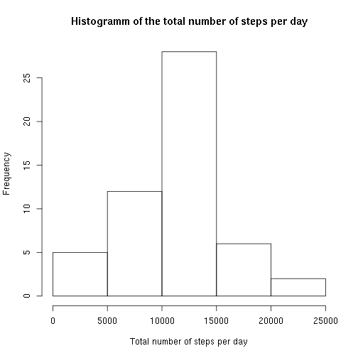
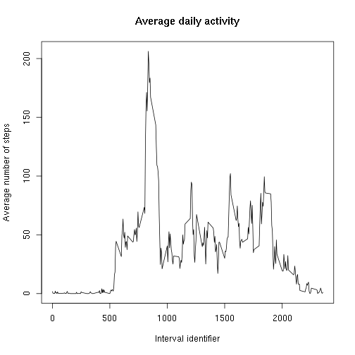
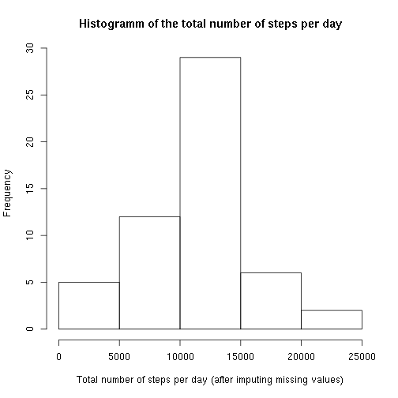
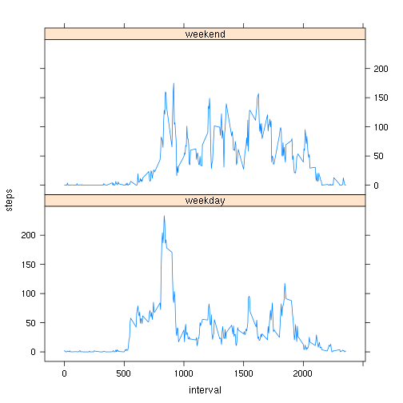

# Reproducible Research: Peer Assessment 1
by Silvia Bahmann

## Loading and preprocessing the data

The data is loaded by first unzipping the data file and then reading the csv. The date column is converted to POSIXct for better handling.


```r
unzip("activity.zip")
f <- read.csv("activity.csv")
f$date = as.POSIXct(f$date)
```

## What is mean total number of steps taken per day?

First the total number of steps per day is calculated by summing up the steps on each day. The histogramm of the total number of steps per day is shown below the code.


```r
daysteps <- aggregate(steps ~ date, data = f, FUN = sum, na.rm = TRUE)
hist(daysteps$steps, xlab = "Total number of steps per day", 
        main = "Histogramm of the total number of steps per day")
```

 

The mean and the median of the total number of steps per day is:


```r
meansteps <- mean(daysteps$steps)
mediansteps <- median(daysteps$steps)
meantable.withNA <- data.frame(with_NA = c(meansteps, mediansteps),
                       row.names = c('mean', 'median'))
print(meantable.withNA)
```

```
##         with_NA
## mean   10766.19
## median 10765.00
```


## What is the average daily activity pattern?

The mean of the steps for each five-minute interval across all days needs to be calculated. Then the result is plotted.


```r
av.steps <- aggregate(steps ~ interval, data = f, FUN = mean, na.rm = TRUE)
plot(av.steps, type = "l", xlab = "Interval identifier", 
     ylab = "Average number of steps", main = "Average daily activity")
```

 


```r
library(dplyr)
max.steps <- filter(av.steps, steps == max(steps))
```

The interval identifier with the maximal number of steps averaged across all days is 835 and the average steps taken during this interval are 206.1698113.

## Imputing missing values

Finding the number of rows that contain missing values by using complete.cases() which returns a vector of TRUEs and FALSEs. Summing up NOT(vector) gives the number of rows containing NAs since TRUE is regarded as 1 and FALSE as 0.


```r
sum(!complete.cases(f))
```

```
## [1] 2304
```

The missing values are imputed by using the mean of the steps of the corresponding interval averaged over all days. For this one can use the above-calculated av.steps list. A new dataset f.imp is created.


```r
f.imp <- f
f.imp <- transform(f.imp, steps = ifelse(is.na(steps), av.steps[av.steps$interval == interval, 2], steps))
```

Plot a histogramm of the total number of steps per day:


```r
daysteps.imp <- aggregate(steps ~ date, data = f.imp, FUN = sum)
hist(daysteps.imp$steps, 
     xlab = "Total number of steps per day (after imputing missing values)", 
     main = "Histogramm of the total number of steps per day")
```

 

Report the mean and median of the total number of steps per day and compare them to the ones before imputing missing values.


```r
meansteps.imp <- mean(daysteps.imp$steps)
mediansteps.imp <- median(daysteps.imp$steps)
meantable <- data.frame(with_NA = c(meansteps, mediansteps),
                       without_NAs = c(meansteps.imp, mediansteps.imp),
                       row.names = c('mean', 'median'))
print(meantable)
```

```
##         with_NA without_NAs
## mean   10766.19    10766.19
## median 10765.00    10765.59
```

Imputing missing values with the above mentioned strategy conserves the mean and includes only little changes into the median value.

## Are there differences in activity patterns between weekdays and weekends?

For comparing the activity patterns between weekdays and weekends a newly created factor variable denoting which day is weekday or weekend is added to the data frame with imputed values. Since the weekdays() function delivers the names of the days these have to be converted to "weekend" or "weekday". Make a panel plot containing a time series plot of the 5-minute interval and the average number of steps taken, averaged across all weekday days or weekend days.


```r
f.imp <- mutate(f.imp, day = factor(ifelse(weekdays(date) %in% c("Samstag", "Sonntag"), "weekend", "weekday")))
avsteps.imp <- aggregate(steps ~ interval + day, data = f.imp, FUN = mean)
library(lattice)
xyplot(steps ~ interval | day, data = avsteps.imp, layout = c(1, 2), type = "l")
```

 
